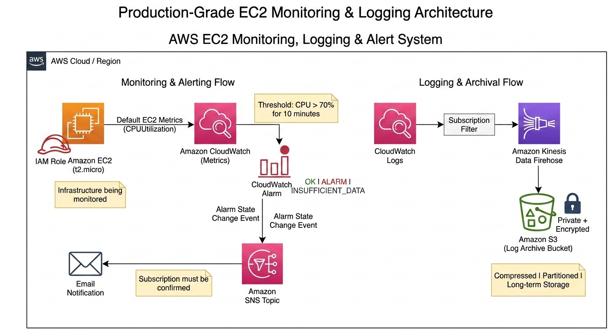

# AWS EC2 Monitoring, Logging & Alert System

## 🏗 Production-Grade Architecture Diagram



---

## Quick Summary

This project implements a **fully managed AWS monitoring, alerting, and log archival pipeline** for an Amazon EC2 instance.

It uses:

* Amazon EC2
* Amazon CloudWatch (Metrics & Alarms)
* Amazon SNS (Email Notifications)
* Amazon CloudWatch Logs
* Amazon Kinesis Data Firehose
* Amazon S3 (Secure Log Archive)

The system detects sustained CPU overload, triggers automated email alerts, and archives logs securely for long-term retention — following production DevOps best practices.

---

# 📑 Table of Contents

1. [Project Overview](#project-overview)
2. [Problem Statement](#problem-statement)
3. [Monitoring vs Logging vs Alerting](#monitoring-vs-logging-vs-alerting)
4. [High-Level Architecture](#high-level-architecture)
5. [Detailed Architecture Explanation](#detailed-architecture-explanation)
6. [AWS Services Used](#aws-services-used)
7. [System Data Flow (Step-by-Step)](#system-data-flow-step-by-step)
8. [EC2 Configuration Details](#ec2-configuration-details)
9. [CloudWatch Alarm Configuration](#cloudwatch-alarm-configuration)
10. [SNS Notification System](#sns-notification-system)
11. [Logging & Archival Design](#logging--archival-design)
12. [Security Best Practices Applied](#security-best-practices-applied)
13. [Scalability & Extension Strategy](#scalability--extension-strategy)
14. [Testing & Validation Process](#testing--validation-process)
15. [Production Relevance](#production-relevance)
16. [Interview Explanation (2-Minute Version)](#interview-explanation-2-minute-version)
17. [Resume-Ready Description](#resume-ready-description)

---

# Project Overview

This project builds a **production-ready monitoring, alerting, and logging pipeline** for an Amazon EC2 instance.

The system continuously:

* Monitors CPU utilization
* Detects sustained abnormal usage
* Sends automated email alerts
* Archives logs securely in Amazon S3

The architecture reflects how real-world DevOps teams implement baseline observability in cloud environments.

---

# Problem Statement

In production systems:

* Servers rarely fail instantly
* Performance degrades gradually
* Resource exhaustion goes unnoticed
* Small issues escalate into outages

Without monitoring:

* Teams discover problems after users complain
* Downtime increases
* Root cause analysis becomes difficult

This project answers a critical operational question:

> How do we detect infrastructure issues before customers experience downtime?

---

# Monitoring vs Logging vs Alerting

Understanding the distinction is essential.

---

## Monitoring

Monitoring tracks numeric health indicators.

Example:

CPUUtilization = 82%

Monitoring answers:

* Is the system healthy right now?

---

## Logging

Logging stores detailed event records.

Examples:

* Application errors
* System events
* Security logs

Logging answers:

* What exactly happened?
* Why did it happen?

---

## Alerting

Alerting sends notifications when abnormal conditions occur.

Example:

* Send email if CPU > 70% for 10 minutes

Alerting answers:

* Who needs to act immediately?

---

## How They Work Together

Monitoring detects abnormal behavior.
Alerting triggers response.
Logging supports root cause analysis.

This project prioritizes monitoring and alerting first, then extends to logging and archival.

---

# High-Level Architecture

## Monitoring & Alerting Flow

```
Amazon EC2 (t2.micro)
        │
        ▼
Amazon CloudWatch (Metrics)
        │
        ▼
CloudWatch Alarm
        │
        ▼
Amazon SNS Topic
        │
        ▼
Email Notification
```

---

## Logging & Archival Flow

```
CloudWatch Logs
        │
        ▼
Subscription Filter
        │
        ▼
Amazon Kinesis Data Firehose
        │
        ▼
Amazon S3 (Private | Encrypted | Long-Term Storage)
```

---

# Detailed Architecture Explanation

## 1️⃣ Amazon EC2

* Instance Type: t2.micro (Free-tier eligible)
* Represents production server
* Generates default infrastructure metrics
* No monitoring agent installed

---

## 2️⃣ Amazon CloudWatch (Metrics)

Automatically collects:

* CPUUtilization
* NetworkIn
* NetworkOut
* DiskReadOps
* DiskWriteOps

No configuration required for default metrics.

---

## 3️⃣ CloudWatch Alarm

Configuration:

* Threshold: CPU > 70%
* Period: 5 minutes
* Evaluation Periods: 2

Meaning:

CPU must remain above 70% for 10 continuous minutes before triggering.

This avoids false positives caused by temporary spikes.

Alarm states:

* OK
* ALARM
* INSUFFICIENT_DATA

---

## 4️⃣ Amazon SNS

When alarm enters ALARM state:

* CloudWatch publishes event to SNS
* SNS sends notification to subscribers

Configuration:

* Protocol: Email
* Subscription must be confirmed

SNS decouples monitoring logic from notification delivery.

---

## 5️⃣ Amazon CloudWatch Logs

Used to centralize logs from AWS-managed services.

Note:

EC2 does not send OS logs automatically without CloudWatch Agent.

---

## 6️⃣ Amazon Kinesis Data Firehose

Acts as a managed log delivery pipeline.

Capabilities:

* Buffers log data
* Compresses logs
* Retries failed deliveries
* Streams to S3

Fully managed and auto-scaling.

---

## 7️⃣ Amazon S3 (Log Archive)

Used for:

* Long-term storage
* Compliance
* Auditing

Best practices applied:

* Private bucket
* Encryption enabled
* Lifecycle rules configured

---

# System Data Flow (Step-by-Step)

1. EC2 runs workload.
2. AWS hypervisor collects metrics.
3. CloudWatch stores metric data.
4. Alarm evaluates CPU usage.
5. CPU exceeds threshold for 10 minutes.
6. Alarm changes to ALARM state.
7. SNS sends email notification.
8. Logs captured in CloudWatch Logs.
9. Subscription filter streams logs to Firehose.
10. Firehose delivers compressed logs to S3.

Entire workflow is automated and serverless.

---

# EC2 Configuration Details

## Security Group

Inbound:

* SSH (Port 22) restricted to specific IP

Outbound:

* Allow all (required for AWS API communication)

---

## IAM Role

* No access keys stored
* Least privilege permissions
* Secure service-to-service authentication

---

## Region Consistency

All services are deployed within the same AWS region for compatibility and performance.

---

# CloudWatch Alarm Configuration

| Parameter          | Value          |
| ------------------ | -------------- |
| Metric             | CPUUtilization |
| Threshold          | > 70%          |
| Period             | 5 Minutes      |
| Evaluation Periods | 2              |
| Total Duration     | 10 Minutes     |

Why 70%?

* Below 70% is generally safe for burstable instances
* Sustained 70%+ indicates potential overload

---

# SNS Notification System

Flow:

CloudWatch Alarm → SNS Topic → Email

Important:

Email subscriptions must be confirmed before receiving alerts.

---

# Logging & Archival Design

CloudWatch Logs cannot directly stream to S3.

Firehose is required as the managed delivery service.

Benefits:

* Near real-time streaming
* Built-in compression
* Automatic scaling
* No infrastructure management

---

# Security Best Practices Applied

* IAM roles instead of access keys
* Least privilege policies
* S3 encryption enabled
* Private bucket configuration
* Log lifecycle management
* No hardcoded credentials
* Single-region consistency

---

# Scalability & Extension Strategy

This architecture can be extended to:

* Monitor multiple EC2 instances using Auto Scaling Groups
* Add memory/disk monitoring using CloudWatch Agent
* Integrate Slack or PagerDuty via SNS
* Implement centralized logging across multiple AWS accounts
* Deploy Multi-AZ infrastructure
* Add dashboards for real-time visualization

---

# Testing & Validation Process

## CPU Alarm Testing

* Generate artificial CPU load
* Verify metric increase
* Confirm alarm transitions

## Email Notification Testing

* Confirm SNS subscription
* Trigger alarm
* Validate email receipt

## Log Delivery Testing

* Check S3 bucket
* Verify compressed log files
* Validate timestamps and folder structure

---

# Production Relevance

This architecture reflects baseline observability patterns used in real organizations.

It demonstrates:

* Managed service utilization
* Cost-efficient design
* Secure architecture
* Scalable monitoring pipeline

It forms the foundation for enterprise-level observability systems.

---

# Interview Explanation

This project implements a production-grade EC2 monitoring and logging system using AWS-managed services. CloudWatch collects infrastructure metrics and evaluates CPU thresholds using alarms. When sustained abnormal usage is detected, SNS triggers automated email alerts. Logs from AWS-managed services are centralized in CloudWatch Logs and streamed to S3 via Kinesis Data Firehose for secure long-term archival. The architecture avoids agents, uses IAM role-based access, and follows least-privilege security best practices.

---

# Resume-Ready Description

Designed and implemented a production-grade AWS EC2 monitoring, alerting, and logging architecture using CloudWatch, SNS, S3, and Kinesis Data Firehose. Built an automated observability pipeline with CPU-based alarms, real-time email notifications, centralized log ingestion, and secure long-term archival while applying IAM least-privilege principles and cloud security best practices.

---


